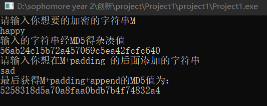

# MD5的长度扩展攻击

## 实验原理：

  使用的MD5代码为从 https://baike.baidu.com/item/MD5/212708?fr=aladdin 中所得到的C++源码。

  在进行长度扩展攻击时，首先自行输入需要攻击的信息字符串M，然后对这个M进行填充后得到M+padding，然后得到H(M)。由于MD5有填充，所以我们需要知道原来的M+padding的长度。在已知H(M)和M+padding的长度的前提下，我们构建一个跟M+padding一样长的字符串（为64字节倍数）。将需要添加的信息append 添加到这个字符串后面，然后进行填充。

  自己创建一个新的计算MD5的函数，并且开始计算杂凑值，在计算到append之前，将A,B,C,D对应的中间变量替换为H(M)对应的值，然后继续计算，最终的输出结果就是H(M+padding+append)。

## 代码说明：

        这个函数就是长度拓展攻击，他和普通的MD5只有最后一步不一样，在计算到拓展的部分之前，将链接变量替换为攻击的hash值。然后再进行后续的计算。

```c
string length_extension(int len1,unsigned int*result,string source)
{
    atemp = A;    //初始化
    btemp = B;
    ctemp = C;
    dtemp = D;
    unsigned int* strByte = add(source);
    for (unsigned int i = 0; i < len1 / 16; i++)//在对最后append进行加密之前
    {
        unsigned int num[16];
        for (unsigned int j = 0; j < 16; j++)
            num[j] = strByte[i * 16 + j];
        mainLoop(num);
    }
    atemp = result[0];
    btemp = result[1];
    ctemp = result[2];
    dtemp = result[3];
    for (unsigned int i = len1/16; i < strlength / 16; i++)//在对最后append进行加密之前
    {
        unsigned int num[16];
        for (unsigned int j = 0; j < 16; j++)
            num[j] = strByte[i * 16 + j];
        mainLoop(num);
    }
    return changeHex(atemp).append(changeHex(btemp)).append(changeHex(ctemp)).append(changeHex(dtemp));
}
```

        在main中首先输入想要加密的字符串M，然后使用add（）函数填充后计算MD5值并输出。将此时的结果作为链接变量存储起来。

        然后首先获得一个跟M+padding一样长的字符串s2，然后输入想要添加的字符串，并将这个字符串添加到s2后面。

        然后进行长度拓展攻击，并输出结果。

```c
unsigned int main()
{
    string s1;
    cout << "请输入你想要的加密的字符串M" << endl;
    cin >> s1;
    unsigned int* strB1 = add(s1);
    unsigned int len1 = strlength;
    string ss1 = getMD5(s1);
    cout << "输入的字符串经MD5得杂凑值\n" << ss1 << endl;
    unsigned int result[4] = { atemp,btemp,ctemp,dtemp };


    int num = strlength / 16;
    string s2(num*64, 'a');//此处是为了获得和M+padding相等长度的字符串
    string temp;
    cout << "请输入你想在M+padding 的后面添加的字符串" << endl;
    cin >> temp;
    s2.append(temp);//此处获得了和M+padding+append 相等长度的字符串

    string ss2 = length_extension(len1, result, s2);
    cout << "最后获得M+padding+append的MD5值为：\n" << ss2 << endl;
    return 0;
}
```

## 测试方法：

将length_extension_attack.cpp文件放到项目中运行或者运行project1.exe文件即可

## 结果截图

