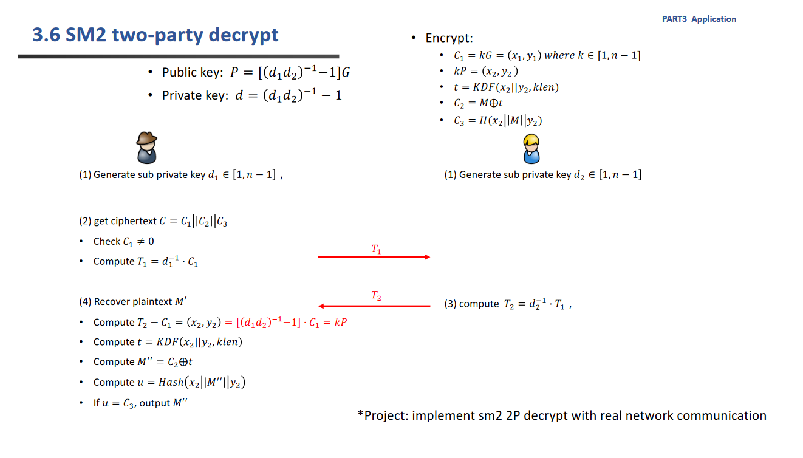
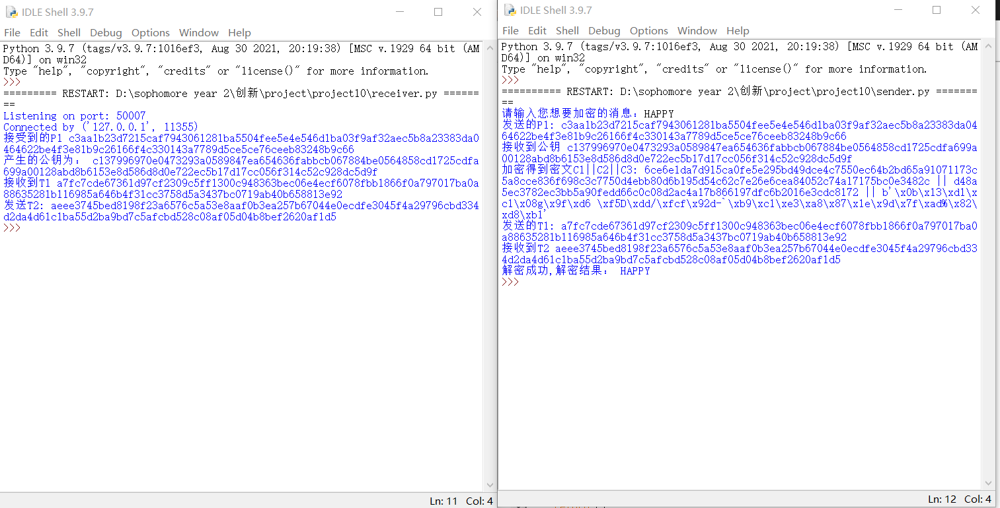

# implement sm2 2P decrypt with real network communication

      完全根据ppt来进行设计,并且设计了两个脚本sender和receiver来模拟左右的两个人。利用了socket的TCP连接来模拟真实的网络交流。



## 代码说明：

### 函数定义：

    generate_d1() 用来生成符合sm2曲线要求的私钥。对于receiver来说有类似的generate_d2()。

```python
def generate_d1():
    """
    产生初始的d1
    """
    n=int(ecctable['n'],16)
    d1=random.randint(1,n-1)
    return d1
```

    generate_G_1(G) G为椭圆曲线上一点x||y，这个函数是为了获得G的逆元-G

```python
def generate_G_1(G):
    """
    产生-G
    """
    sm2_c=sm2.CryptSM2(private_key="",public_key="")
    leng=len(G)
    xg=G[0:sm2_c.para_len]
    yg=G[sm2_c.para_len:leng]
    yg=int(yg,16)
    yg=(-yg)%int(ecctable['p'],16)
    yg=hex(yg)[2:]
    G_1=xg+yg
    return G_1
```

generate_P1(d1): 用来产生  $ d1^{-1}$ *G ，为了后续生成公钥P所用。

```python
def generate_P1(d1):
    """
    用来产生P1
    """
    n=int(ecctable['n'],16)
    sm2_c=sm2.CryptSM2(private_key="",public_key="")
    P1=sm2_c._kg(inverse(d1,n),ecctable['g'])
    return P1
```

完全按照ppt所演示的sm2两方加密函数

```python
def Encrypt_2p(k,P,m):
    """
    加密函数
    """
    m=str(m)
    n=int(ecctable['n'],16)
    sm2_c=sm2.CryptSM2(private_key="",public_key="")
    C1=sm2_c._kg(k,ecctable['g'])
    KP=sm2_c._kg(k,P)
    t=scrypt(KP,salt,32,2**14,8,1,1)
    t=int(t.hex(),16)
    m_int=int(str(m).encode('utf-8').hex(),16)
    C2=m_int^t
    C2=hex(m_int^t)[2:]
    len1=len(KP)
    C3=sha256(KP[0:sm2_c.para_len].encode('utf-8')+m.encode('utf-8')+KP[sm2_c.para_len:len1].encode('utf-8')).digest()
    return (C1,C2,C3)
```

两方加密的时候通过交换信息由receiver来生成公钥P的函数

```python
def generate_P(d2,P1):
    """
    产生公钥
    """
    n=int(ecctable['n'],16)
    sm2_c=sm2.CryptSM2(private_key="",public_key="")
    temp=sm2_c._kg(inverse(d2,n),P1)
    G_1=generate_G_1(ecctable['g'])#-G
    P=sm2_c._add_point(temp,G_1)#两个点相加
    P=sm2_c._convert_jacb_to_nor(P)#得到最终的x||y
    return P
```

### 测试说明

以下按照交换信息的流程来进行说明，并不是两个实际文档中的顺序

首先是receiver，准备监听TCP连接

```python
HOST = ''
PORT = 50007
s = socket.socket(socket.AF_INET, socket.SOCK_STREAM)
s.bind((HOST, PORT))
s.listen(5)
print('Listening on port:',PORT)
conn, addr = s.accept()
print('Connected by', addr)
```

接着是sender 连接receiver。

```python
HOST = '127.0.0.1'
PORT = 50007
s = socket.socket(socket.AF_INET, socket.SOCK_STREAM)
try:
    s.connect((HOST, PORT))
except Exception as e:
    print('Server not found or not open')
    sys.exit()
```

然后sender计算$ d_1^{-1}*G$ =P1发送给receiver

```python
d1=generate_d1()
P1=generate_P1(d1)
s.sendall(P1.encode('utf-8'))#发送P1

```

receiver接受P1，并生成自己的私钥来生成公钥P，并发送给sender

```python
P1 = conn.recv(1024).decode('utf-8')#接受P1

d2=generate_d2()
P=generate_P(d2,P1)#产生公钥
print("产生的公钥为：",P)
conn.sendall(P.encode("utf-8"))
```

sender接受P，并生成随机数k来加密信息，获得密文C1||C2||C3

接着开始解密过程，计算$ T_1=d_1^{-1}*C_1$ ,发送给receiver、

```python
P = s.recv(1024).decode('utf-8')
k=generate_d1()#生成一个随机数（0，n-1）
C1,C2,C3=Encrypt_2p(k,P,m)#此处利用加密生成了所有的密文

assert C1!='',"C1=0"

n=int(ecctable['n'],16)
sm2_c=sm2.CryptSM2(private_key="",public_key="")
T1=sm2_c._kg(inverse(d1,n),C1)

s.sendall(T1.encode('utf-8'))#发送T1
```

receiver接受T1,并且计算$ T_2=d_2^{-1}*T_1$ 发送给sender

```python
T1=conn.recv(1024).decode('utf-8')
n=int(ecctable['n'],16)
sm2_c=sm2.CryptSM2(private_key="",public_key="")
T2=sm2_c._kg(inverse(d2,n),T1)

conn.sendall(T2.encode("utf-8"))
```

sender接受T2，然后计算$KP=T_2-C_1$，接着计算$t=KDF(x_2||y_2,klen)$ ,接着计算出$m'=C_2 \oplus t$ ,再计算出u=hash（x2||m'||y2），检测u是否等于C3，即可确定解密是否正确，最后输出解密结果

```pythoN
T2= s.recv(1024).decode('utf-8')#接受T2

C1_1=generate_G_1(C1)

KP=sm2_c._add_point(T2,C1_1)#两个点相加
KP=sm2_c._convert_jacb_to_nor(KP)#得到最终的x||y

t=scrypt(KP,salt,32,2**14,8,1,1)
t=int(t.hex(),16)
m_d=hex(int(C2,16)^t)[2:]
m_d=bytes().fromhex(m_d).decode('utf-8')
len1=len(KP)
u=sha256(KP[0:sm2_c.para_len].encode('utf-8')+m_d.encode('utf-8')+KP[sm2_c.para_len:len1].encode('utf-8')).digest()

if u==C3 :
    print('解密成功,解密结果：',m_d)
```

### 测试方法：

    先运行receiver，再运行sender，然后在sender里面输入你想要加密的信息，则可以看到产生的公钥和解密结果

运行结果展示：

 