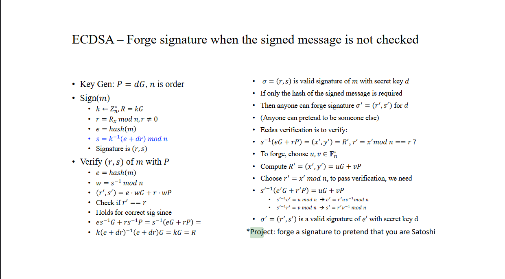
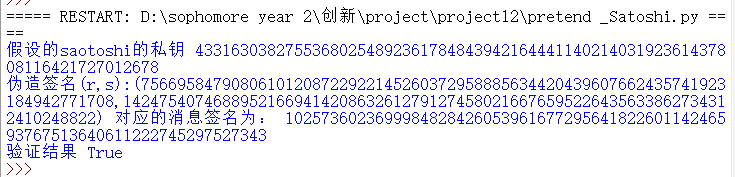

# forge a signature to pretend that you are Satoshi

      本项目实现了在不检查消息的前提下伪造satoshi的签名。原理完全按照以下老师的ppt进行。



    

## 代码说明：

### 实验过程：

        本次实验引用了ecdsa库，这个库里面有各种椭圆曲线以及对应的方法，可以保证实验结果的权威性。

        引用了 Crypto.Util.num，主要利用了其中的求逆函数

```python
import ecdsa
import random
from hashlib import sha256
from Crypto.Util.number import *
```

        接下来首先获得NIST256p椭圆曲线的生成元，并获得该曲线的阶。然后随机生成一个合法的私钥作为satoshi的私钥（因为无法获知真实的satoshi的公钥)。该私钥只用于生成公钥P，往后不再会出现，来体现攻击的目的。

        最后再生成ecdsa的公钥对象，主要用于最后的检验签名是否合理

```python
G=ecdsa.NIST256p.generator#获得NIST256p的生成元
n=G.order()#NIST256p椭圆曲线的阶
privateKey = random.randint(1,n-1)#生成一个随机私钥
print("假设的saotoshi的私钥",privateKey)
P=G*privateKey#此为公钥
publicKey = ecdsa.ecdsa.Public_key(G,G * privateKey)#生成公钥对象
```

生成两个随机数u，v并且计算R=u*G+v *P ,得到ppt中所提到的 r' 。按照公式$ s'=r'*v^{-1}$,$ e'=r'*v^{-1}*u$  计算出伪造的签名和对应的消息的hash。

```python
u=random.randint(1,n-1)
v=random.randint(1,n-1)

R=G.mul_add(u,P,v)#此为u*G+v*P
x1=R.x()
r1=x1%n
e1=(r1*u*inverse(v,n))%n
s1=(r1*inverse(v,n))%n
```

        最后输出两个签名以及消息的hash，生成签名对象，并输出验证结果

```python
print("伪造签名(r,s):(%d,%d)"%(r1,s1),"对应的消息签名为：",e1)
sig=ecdsa.ecdsa.Signature(r1,s1)

print("验证结果",publicKey.verifies(e1,sig))
```

## 测试方法：

直接运行脚本即可，需要利用pip安装ecdsa

运行截图：

