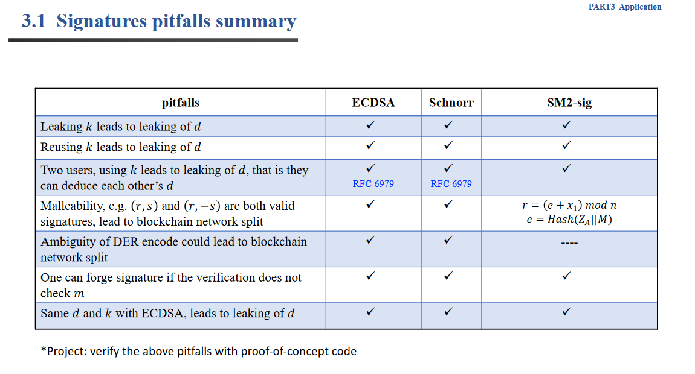
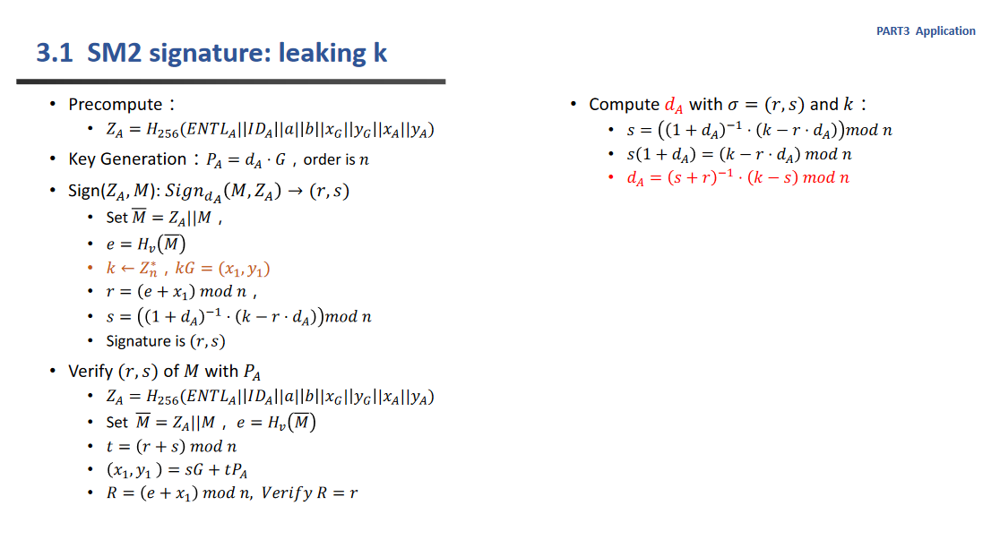
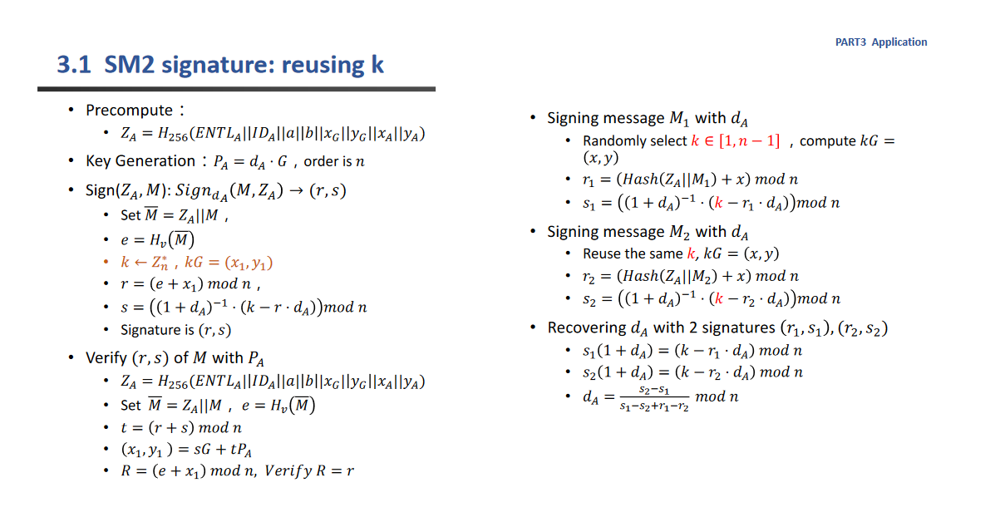
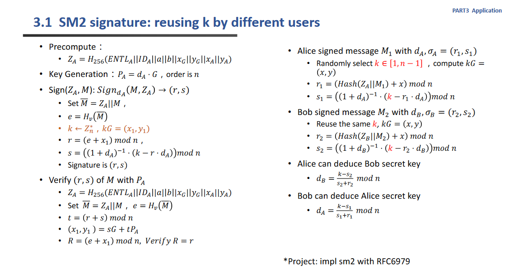
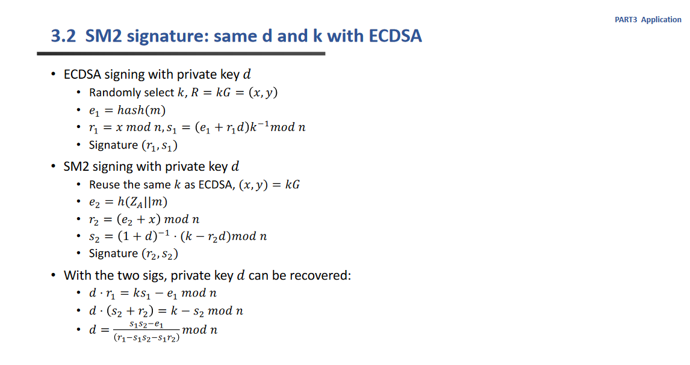
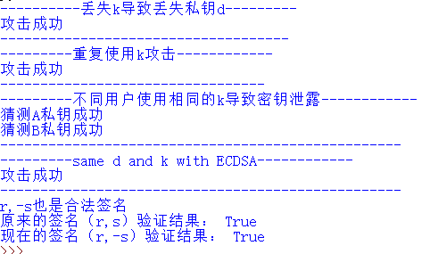

# verify the above pitfalls with proof-of-concept code

      本项目验证了关于椭圆曲线签名的陷阱。如下面ppt所示



    

## 代码说明：

        本次实验引用了以下的库

```python
import ecdsa
from hashlib import sha256
from Crypto.Util.number import *
from gmssl import sm2 ,sm4,func
import random 
```

## 一.leaking k leads to leaking of d

        当泄露k的时候导致d泄露

### 实验原理：



        根据以上实验原理，可以写出以下函数，当已经知道k，r，s的时候，可以计算出私钥

```python
def leaking_k(k,r,s):
    """
    丢失k导致丢失d
    此处的参数都是int类型
    """
    d=(inverse((s+r),N)*(k-s))%N

    return d
```

        根据以下代码来测试以上函数。首先设置sm2的加密器（其中private_key,public_key都是已经定义好的常量），然后生成随机的k，对data进行签名，获得r,s。

        然后运行leaking_k获得计算出的私钥，和真实的私钥进行对比，如果正确则输出攻击成功。

```python
#------------丢失k导致丢失私钥d--------------
sm2_crypt=sm2.CryptSM2(private_key=private_key,public_key=public_key)#设置好加解密器

data = b"111" # bytes类型
random_hex_str = func.random_hex(sm2_crypt.para_len)#随机的k
sign = sm2_crypt.sign(data, random_hex_str) #进行签名

k=int(random_hex_str,16)
r = int(sign[0:sm2_crypt.para_len], 16)
s = int(sign[sm2_crypt.para_len:2*sm2_crypt.para_len], 16)
print("----------丢失k导致丢失私钥d---------")
d1=leaking_k(k,r,s)
if d1==int(private_key,16):
    print("攻击成功")
print("------------------------------------")
```


## 二.Reusing k leads to leaking of k

        重复使用相同的k，导致私钥泄露。

### 实验原理：



        根据以上实验原理，可以设计出以下函数。在已知两次使用了同一个k的签名情况下，可以直接计算出私钥d出来。其中ppt中所展示的除法其实应该是对于椭圆曲线的阶的求逆。

```python
def reusing_k(r1,s1,r2,s2):

    t=(s2-s1)%N
    t2=inverse(s1-s2+r1-r2,N)
    d=(t*t2)%N
    return d
```

        使用以下代码来进行测试，首先随机生成一个k，然后对不同的数据进行一次签名，获得（r1,s1），（r2,s2)。然后将这四个参数输入到以上的函数当中，计算得到私钥。验证是否正确，如果正确则输出攻击成功。

```python
#------------重复使用k导致私钥d泄露——
random_hex_str = func.random_hex(sm2_crypt.para_len)
#签名第一次
data = b"111" 
sign1 = sm2_crypt.sign(data, random_hex_str) #  16进制
r1 = int(sign1[0:sm2_crypt.para_len], 16)
s1 = int(sign1[sm2_crypt.para_len:2*sm2_crypt.para_len], 16)
#同一个k签名第二次
data = b"222" # bytes类型
sign2 = sm2_crypt.sign(data, random_hex_str) #  16进制
r2 = int(sign2[0:sm2_crypt.para_len], 16)
s2 = int(sign2[sm2_crypt.para_len:2*sm2_crypt.para_len], 16)
print("---------重复使用k攻击------------")
d1=reusing_k(r1,s1,r2,s2)
if d1==int(private_key,16):
    print("攻击成功")
print("---------------------------------")
```


## 三.reusing k by different users

        不同的用户使用重复的k

### 实验原理：



        根据以上原理设计出以下函数，只要输入共同的k以及另一个用户的s，r，就可以获得另一个人的私钥

```python
def reusing_k_by_different_user(r,s,k):

    t=(k-s)%N
    t2=inverse(s+r,N)
    d=(t*t2)%N
    return d
```

        使用以下代码来测试以上函数。首先生成一个随机的k，然后对于A,B两个不同的用户，分别生成自己的私钥以及加密器，对不同的数据进行签名，获得rA,sA,rB,sB。然后两人分别利用对方的签名和共同的k来猜测对方的密钥并进行验证。如果验证成功，则输出成功。

```python
#---------------不同用户使用相同的k导致密钥泄露----------

random_hex_str = func.random_hex(sm2_crypt.para_len)
k=int(random_hex_str,16)
dA=func.random_hex(64)#256bit私钥
A=sm2.CryptSM2(private_key=dA,public_key="")#此处用不上所以不要了
data = b"111" 
signA=A.sign(data, random_hex_str)
rA = int(signA[0:sm2_crypt.para_len], 16)
sA = int(signA[sm2_crypt.para_len:2*sm2_crypt.para_len], 16)

dB=func.random_hex(64)#256bit私钥
B=sm2.CryptSM2(private_key=dB,public_key="")#此处用不上所以不要了
data = b"222" 
signB=B.sign(data, random_hex_str)
rB = int(signB[0:sm2_crypt.para_len], 16)
sB = int(signB[sm2_crypt.para_len:2*sm2_crypt.para_len], 16)


print("---------不同用户使用相同的k导致密钥泄露------------")
da=reusing_k_by_different_user(rA,sA,k)

if(da==int(dA,16)):
    print("猜测A私钥成功")

db=reusing_k_by_different_user(rB,sB,k)

if(db==int(dB,16)):
    print("猜测B私钥成功")
print("--------------------------------------------------")
```

## 四.same d and k with ECDSA

当SM2签名和ECDSA签名使用了相同的d和k。

### 实验原理：



        首先设计了ECDSA的签名函数，参数全部采用的sm2曲线的参数。返回的除了正常的r和s以外，把e也顺便返回了。

```python
def ECDSA_sign(m,k,d):
    """
    利用sm2曲线的参数来计算
    """
    sm2_c=sm2.CryptSM2(private_key=d,public_key="")
    R=sm2_c._kg(k,ecctable["g"])
    r=int(R[0:sm2_c.para_len],16)%N
    E = m.hex() # 消息转化为16进制字符串
    e = int(E, 16)
    s=((e+r*int(d,16))*inverse(k,N))%N
    k1=(int(d,16)*r+e)*inverse(s,N)
    k1=k1%N

    return (r,s,e)
```

        接着按照ppt中所示的原理，根据e1,r1,s1,r2,s2计算出私钥出来。

```python
def same_d_and_k_with_ECDSA(e1,r1,s1,r2,s2):
    t1=(s1*s2-e1)%N
    t2=inverse(r1-s1*s2-s1*r2,N)
    d=(t1*t2)%N
    return d

```

        接着按照以下代码进行测试。

        首先生成一个随机的k和d，然后分别对不同的数据进行ECDSA和sm2签名。根据得到的签名和第一个消息的hash值，我们带入函数得到私钥。验证私钥，如果正确则输出。

```python
#-----------------same d and k with ECDSA-----------

random_hex_str = func.random_hex(64)
k=int(random_hex_str,16)
d=func.random_hex(64)#256bit私钥
data = b"222" 
r1,s1,e1=ECDSA_sign(data,k,d)

data = b"111" 
sm2_cry=sm2.CryptSM2(private_key=d,public_key="")
sign=sm2_cry.sign(data, random_hex_str)
r2 = int(sign[0:sm2_cry.para_len], 16)
s2 = int(sign[sm2_cry.para_len:2*sm2_cry.para_len], 16)
#r2,s2=sm2_sign(data,k,d)


d1=same_d_and_k_with_ECDSA(e1,r1,s1,r2,s2)

print("---------same d and k with ECDSA------------")
if(d1==int(d,16)):
    print("攻击成功")
print("--------------------------------------------------")
```


## 五.(r,s) and (r,—s) are both valid signatures

        此处使用ecdsa来验证这个结果，首先获得NIST256p的生成元，并且获得这个曲线的阶。随机生成一个私钥，并创建公钥类和私钥类（分别用来验签和签名）。

        然后对消息的hash进行签名，并验证一下这个。

        接着再验证一下（r,-s).并输出结果

```python
#--------------  r,-s也是合法签名--------------
print("r,-s也是合法签名")
gen=ecdsa.NIST256p.generator
rank=gen.order()
privateKey = random.randrange(1,rank-1)
publicKey = ecdsa.ecdsa.Public_key(gen,gen * privateKey)
private_key = ecdsa.ecdsa.Private_key(publicKey,privateKey)
message = "zhangjixian"
m = int(sha256(message.encode("utf8")).hexdigest(),16)
k = random.randrange(1,rank-1)
signature = private_key.sign(m,k)
print("原来的签名（r,s）验证结果：",publicKey.verifies(m, signature))
r = signature.r
s = signature.s
s=-s%rank
signature.s=s
print("现在的签名（r,-s）验证结果：",publicKey.verifies(m, signature))
```


## 测试方法：

直接运行脚本即可

