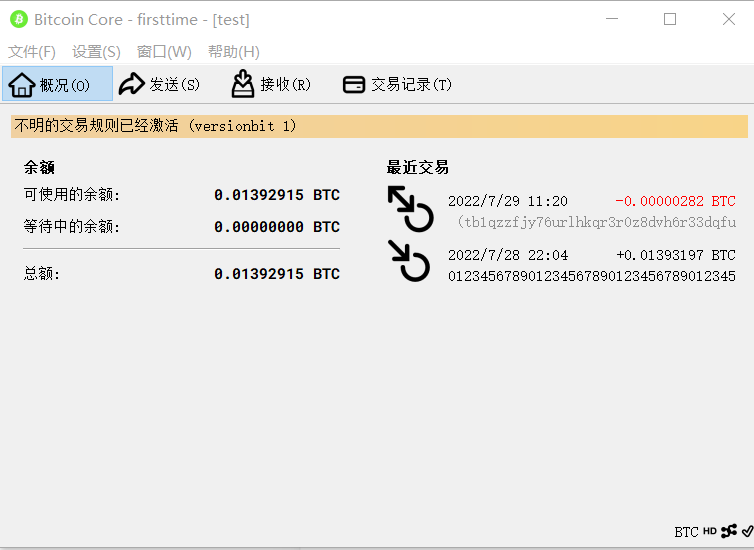
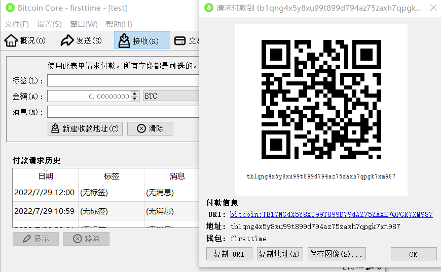
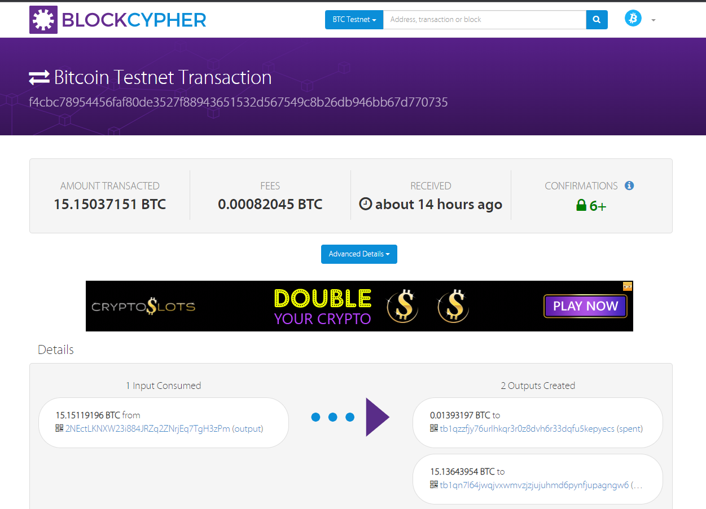
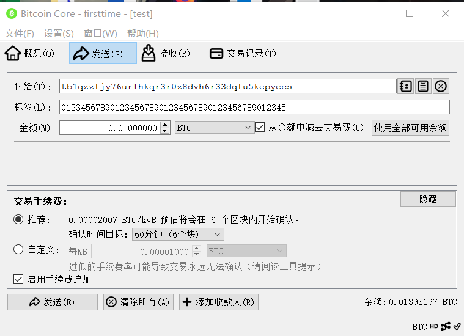
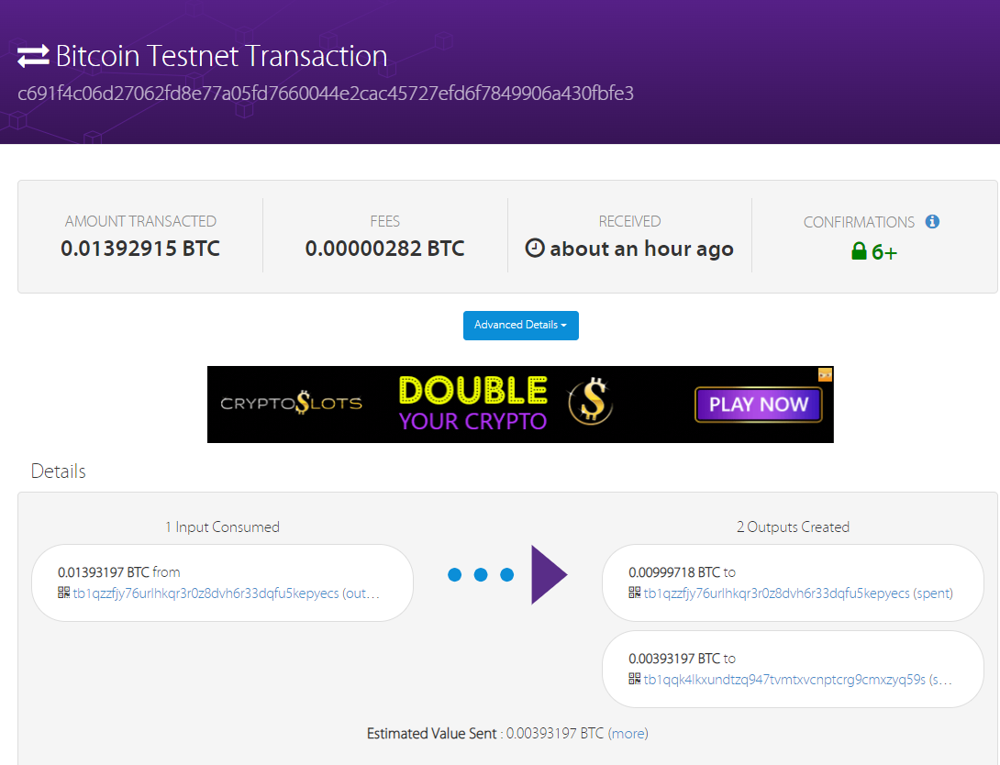
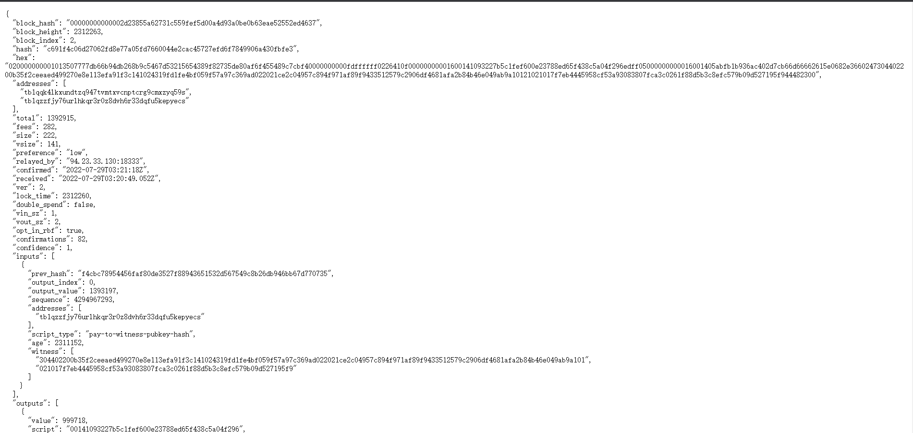
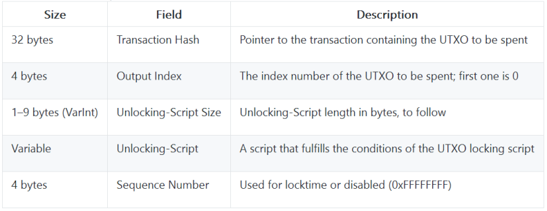
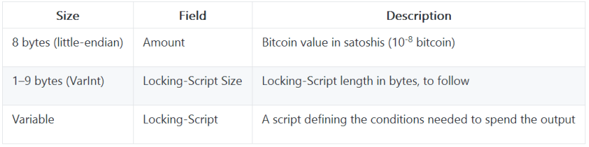
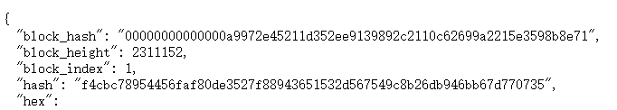

# send a tx onBitcoin testnet, and parse the tx data down to every bit, better write script yourself

      本报告主要讲述如何在bitcoin的testnet上发布一笔交易并且分析原始交易的源码。

## 一.下载bitcoin钱包并创建收款地址

        首先在[Download - Bitcoin](https://bitcoin.org/en/download) 中下载适合的钱包，我这里下载了bitcoin core，并且在命令行模式中加参数 -testnet 启动，得到以下绿色图表界面。

        在接收一栏当中我们可以创建自己的收款地址，在测试网中地址都是以tb开头的,其中标签可以任意的添加。

## 二. 领取免费比特币

        接着是领取免费的比特币。在https://coinfaucet.eu/en/btc-testnet中输入你的收款地址就可以接收到免费的bitcoin了。

        我们在区块链浏览器可以看到这笔交易，所以我们现在有了0.01393197的bitcoin。

      

## 三.发起一笔交易

        在发送中向自身的地址发送0.01BTC，也就是向自身转账，手续费可以自定义也可以。

        接着我们可以在区块链浏览器中查找到这笔交易 https://live.blockcypher.com/btc-testnet/tx/c691f4c06d27062fd8e77a05fd7660044e2cac45727efd6f7849906a430fbfe3/

        查看API,其中hex那一栏就是我们想要分析的tx的原始交易数据

        这一大串数据就是我们的原始交易数据，一共是222 bytes

020000000001013507777db66b94db268b9c5467d53215654389f82735de80af6f455489c7cbf40000000000fdffffff0226410f00000000001600141093227b5c1fef600e23788ed65f438c5a04f296edff05000000000016001405abfb1b936ac402d7cb66d66662615e0682e3660247304402200b35f2ceeaed499270e8e113efa91f3c141024319fd1fe4bf059f57a97c369ad022021ce2c04957c894f971af89f9433512579c2906df4681afa2b84b46e049ab9a10121021017f7eb4445958cf53a93083807fca3c0261f88d5b3c8efc579b09d527195f944482300

## 分析原理图

交易输入格式：

输出格式：

## 接下来我们把原始记录拆开来分析

**版本号**  02000000 小端存储（全网找不到版本2的解析方法）

**输入个数** 000101  不知为何和普通的不一样，应当只有一个输入，可能这里有两个信息

**上一笔交易的hash值**3507777db66b94db268b9c5467d53215654389f82735de80af6f455489c7cbf4 小端存储

可以跟下图对应上

**Pre_index** 00000000    四个字节 即在上一个transaction中，我的UTXO是在所有outputs中的第几个，这里是第一个，可以和我们**领取比特币的交易记录**对应上

**解锁脚本长度**  00  惊人的没有解锁脚本，猜测是因为隔离见证的原因

**sequence** fdffffff 

**输出个数** 02 跟交易记录一致

**第一个输出的金额**  26410f0000000000 小端存储 与交易记录一致

**第一个输出script长度** 16

**第一个输出script** 00141093227b5c1fef600e23788ed65f438c5a04f296

**第二个输出的金额**   edff050000000000

**第二个输出script长度**16

**第一个输出script**  001405abfb1b936ac402d7cb66d66662615e0682e366

**这里猜测是 pay-to-witness-pubkey-hash对应代码** 02

**第一个witness的长度：** 47

**第一个witness：**

304402200b35f2ceeaed499270e8e113efa91f3c141024319fd1fe4bf059f57a97c369ad022021ce2c04957c894f971af89f9433512579c2906df4681afa2b84b46e049ab9a101

**第二个witness的长度**：21

**第二个witness：**

021017f7eb4445958cf53a93083807fca3c0261f88d5b3c8efc579b09d527195f9

44482300

## 综上我们完成了对于一笔交易的每一个bit的解析。由于版本号为2，所以解析十分的困难。