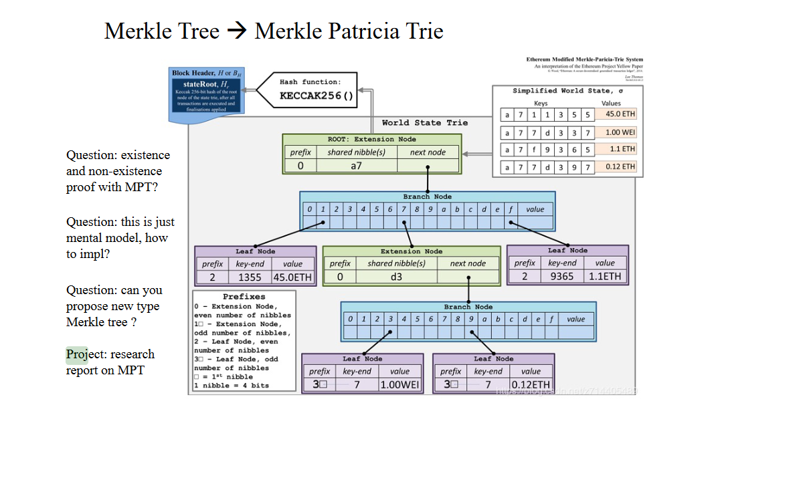

# research report on MPT

        本报告主要对[GitHub - ethereum/go-ethereum: Official Go implementation of the Ethereum protocol](https://github.com/ethereum/go-ethereum)  上go源码进行解析

## 简述

         Merkle Patricia Tree（又称为Merkle Patricia Trie）是一种经过改良的、融合了默克尔树和前缀树两种树结构优点的[数据结构](https://so.csdn.net/so/search?q=%E6%95%B0%E6%8D%AE%E7%BB%93%E6%9E%84&spm=1001.2101.3001.7020)，是以太坊中用来组织管理账户数据、生成交易集合哈希的重要数据结构。

        MPT树有以下几个作用：

- 存储任意长度的key-value键值对数据；
- 提供了一种快速计算所维护数据集哈希标识的机制；
- 提供了快速状态回滚的机制；
- 提供了一种称为默克尔证明的证明方法，进行轻节点的扩展，实现简单支付验证；

## 源码部分解析

### encoding.go:

        trie树的keys使用三种不同的编码方式进行编码：

        KEYBYTES encoding：只包含实际的key，这种编码方式用于编码大多数API接口
        HEX encoding：这种编码格式每一个字节包含了Key的一个半字节，尾部接上一个可选的’终结符’,'终结符’代表这个节点到底是叶子节点还是扩展节点。十六进制键编码用于加载在内存中的节点，因为它方便访问
        COMPACT encoding：这种编码格式就是源码阅读3里面的紧凑编码/十六进制前缀编码，这种编码格式可以看成是HEX encoding这种编码格式的另外一种版本，可以在存储到数据库的时候节约磁盘空间。

        因此在encode.go 中提供了几种编码方式的相互转换方法，分别如下所示

```go
func hexToCompact(hex []byte) []byte {
    terminator := byte(0)
    if hasTerm(hex) {
        terminator = 1
        hex = hex[:len(hex)-1]
    }
    buf := make([]byte, len(hex)/2+1)
    buf[0] = terminator << 5 // the flag byte
    if len(hex)&1 == 1 {
        buf[0] |= 1 << 4 // odd flag
        buf[0] |= hex[0] // first nibble is contained in the first byte
        hex = hex[1:]
    }
    decodeNibbles(hex, buf[1:])
    return buf
}

// hexToCompactInPlace places the compact key in input buffer, returning the length
// needed for the representation
func hexToCompactInPlace(hex []byte) int {
    var (
        hexLen    = len(hex) // length of the hex input
        firstByte = byte(0)
    )
    // Check if we have a terminator there
    if hexLen > 0 && hex[hexLen-1] == 16 {
        firstByte = 1 << 5
        hexLen-- // last part was the terminator, ignore that
    }
    var (
        binLen = hexLen/2 + 1
        ni     = 0 // index in hex
        bi     = 1 // index in bin (compact)
    )
    if hexLen&1 == 1 {
        firstByte |= 1 << 4 // odd flag
        firstByte |= hex[0] // first nibble is contained in the first byte
        ni++
    }
    for ; ni < hexLen; bi, ni = bi+1, ni+2 {
        hex[bi] = hex[ni]<<4 | hex[ni+1]
    }
    hex[0] = firstByte
    return binLen
}

func compactToHex(compact []byte) []byte {
    if len(compact) == 0 {
        return compact
    }
    base := keybytesToHex(compact)
    // delete terminator flag
    if base[0] < 2 {
        base = base[:len(base)-1]
    }
    // apply odd flag
    chop := 2 - base[0]&1
    return base[chop:]
}

func keybytesToHex(str []byte) []byte {
    l := len(str)*2 + 1
    var nibbles = make([]byte, l)
    for i, b := range str {
        nibbles[i*2] = b / 16
        nibbles[i*2+1] = b % 16
    }
    nibbles[l-1] = 16
    return nibbles
}

// hexToKeybytes turns hex nibbles into key bytes.
// This can only be used for keys of even length.
func hexToKeybytes(hex []byte) []byte {
    if hasTerm(hex) {
        hex = hex[:len(hex)-1]
    }
    if len(hex)&1 != 0 {
        panic("can't convert hex key of odd length")
    }
    key := make([]byte, len(hex)/2)
    decodeNibbles(hex, key)
    return key
}
```

        需要注意的是好像没有keybytes和compact形式的互相转换

### node.go



        根据以上ppt内容，node的结构，可以看到源码中node分为4种类型：

        fullNode对应了ppt里面的branch node
        shortNode对应了ppt里面的extention node 和leaf node (通过shortNode.Val的类型来判断当前节点是leaf node(shortNode.Val为valueNode)还是extention node(通过shortNode.Val指向下一个node))。
        hashNode用于指向下一个节点
        valueNode存储value

```go
type (
    fullNode struct {
        Children [17]node // Actual trie node data to encode/decode (needs custom encoder)
        flags    nodeFlag
    }
    shortNode struct {
        Key   []byte
        Val   node
        flags nodeFlag
    }
    hashNode  []byte
    valueNode []byte
)
```

## trie.go

        trie的结构， root包含了当前的root节点

        db是后端的KV存储，trie的结构最终都是需要通过KV的形式存储到数据库里面去，然后启动的时候是需要从数据库里面加载的。

        owenner 即为拥有者的hash

        unhashed用于跟踪上一个被插入的叶子节点，这个数字不会映射到实际的unhashed nodes

        tracer 是状态差异跟踪器，可用于跟踪新的添加/删除操作

```go
type Trie struct {
    db    *Database
    root  node
    owner common.Hash

    // Keep track of the number leaves which have been inserted since the last
    // hashing operation. This number will not directly map to the number of
    // actually unhashed nodes
    unhashed int

    // tracer is the state diff tracer can be used to track newly added/deleted
    // trie node. It will be reset after each commit operation.
    tracer *tracer
}
```

       Trie树的初始化调用New函数，函数接受一个hash值、owner的一个hash值，Database参数，如果hash值不是空值的话，就说明是从数据库加载一个已经存在的Trie树， 就调用trei.resolveHash方法来加载整颗Trie树。 如果root是空，那么就新建一颗Trie树返回。

```go
func newTrie(owner common.Hash, root common.Hash, db *Database) (*Trie, error) {
    if db == nil {
        panic("trie.New called without a database")
    }
    trie := &Trie{
        db:    db,
        owner: owner,
        //tracer: newTracer(),
    }
    if root != (common.Hash{}) && root != emptyRoot {
        rootnode, err := trie.resolveHash(root[:], nil)
        if err != nil {
            return nil, err
        }
        trie.root = rootnode
    }
    return trie, nil
}
```

        Trie树的插入，这是一个递归调用的方法，从根节点开始，一直往下找，直到找到可以插入的点，进行插入操作。参数node是当前插入的节点， prefix是当前已经处理完的部分key， key是还没有处理完的部分key, 完整的key = prefix + key。 value是需要插入的值。 返回值bool是操作是否改变了Trie树(dirty)，node是插入完成后的子树的根节点， error是错误信息。

```go
func (t *Trie) insert(n node, prefix, key []byte, value node) (bool, node, error) {
    if len(key) == 0 {
        if v, ok := n.(valueNode); ok {
            return !bytes.Equal(v, value.(valueNode)), value, nil
        }
        return true, value, nil
    }
    switch n := n.(type) {
    case *shortNode:
        matchlen := prefixLen(key, n.Key)
        // If the whole key matches, keep this short node as is
        // and only update the value.
        if matchlen == len(n.Key) {
            dirty, nn, err := t.insert(n.Val, append(prefix, key[:matchlen]...), key[matchlen:], value)
            if !dirty || err != nil {
                return false, n, err
            }
            return true, &shortNode{n.Key, nn, t.newFlag()}, nil
        }
        // Otherwise branch out at the index where they differ.
        branch := &fullNode{flags: t.newFlag()}
        var err error
        _, branch.Children[n.Key[matchlen]], err = t.insert(nil, append(prefix, n.Key[:matchlen+1]...), n.Key[matchlen+1:], n.Val)
        if err != nil {
            return false, nil, err
        }
        _, branch.Children[key[matchlen]], err = t.insert(nil, append(prefix, key[:matchlen+1]...), key[matchlen+1:], value)
        if err != nil {
            return false, nil, err
        }
        // Replace this shortNode with the branch if it occurs at index 0.
        if matchlen == 0 {
            return true, branch, nil
        }
        // New branch node is created as a child of the original short node.
        // Track the newly inserted node in the tracer. The node identifier
        // passed is the path from the root node.
        t.tracer.onInsert(append(prefix, key[:matchlen]...))

        // Replace it with a short node leading up to the branch.
        return true, &shortNode{key[:matchlen], branch, t.newFlag()}, nil

    case *fullNode:
        dirty, nn, err := t.insert(n.Children[key[0]], append(prefix, key[0]), key[1:], value)
        if !dirty || err != nil {
            return false, n, err
        }
        n = n.copy()
        n.flags = t.newFlag()
        n.Children[key[0]] = nn
        return true, n, nil

    case nil:
        // New short node is created and track it in the tracer. The node identifier
        // passed is the path from the root node. Note the valueNode won't be tracked
        // since it's always embedded in its parent.
        t.tracer.onInsert(prefix)

        return true, &shortNode{key, value, t.newFlag()}, nil

    case hashNode:
        // We've hit a part of the trie that isn't loaded yet. Load
        // the node and insert into it. This leaves all child nodes on
        // the path to the value in the trie.
        rn, err := t.resolveHash(n, prefix)
        if err != nil {
            return false, nil, err
        }
        dirty, nn, err := t.insert(rn, prefix, key, value)
        if !dirty || err != nil {
            return false, rn, err
        }
        return true, nn, nil

    default:
        panic(fmt.Sprintf("%T: invalid node: %v", n, n))
    }
}
```

## 参考文献:

[1] [# 以太坊源码阅读4——MPT源码_mo_seele的博客-CSDN博客](https://blog.csdn.net/qq_50665031/article/details/123555027?ops_request_misc=&request_id=&biz_id=102&utm_term=MPT%E6%BA%90%E7%A0%81&utm_medium=distribute.pc_search_result.none-task-blog-2~all~sobaiduweb~default-0-123555027.142^v35^experiment_28w_v1&spm=1018.2226.3001.4187)

[2][MPT详解_yitahutu79的博客-CSDN博客_mpt是啥](https://blog.csdn.net/qq_40713201/article/details/124486307?ops_request_misc=%257B%2522request%255Fid%2522%253A%2522165914257416781790718749%2522%252C%2522scm%2522%253A%252220140713.130102334..%2522%257D&request_id=165914257416781790718749&biz_id=0&utm_medium=distribute.pc_search_result.none-task-blog-2~all~sobaiduend~default-1-124486307-null-null.142^v35^experiment_28w_v1&utm_term=MPT&spm=1018.2226.3001.4187)