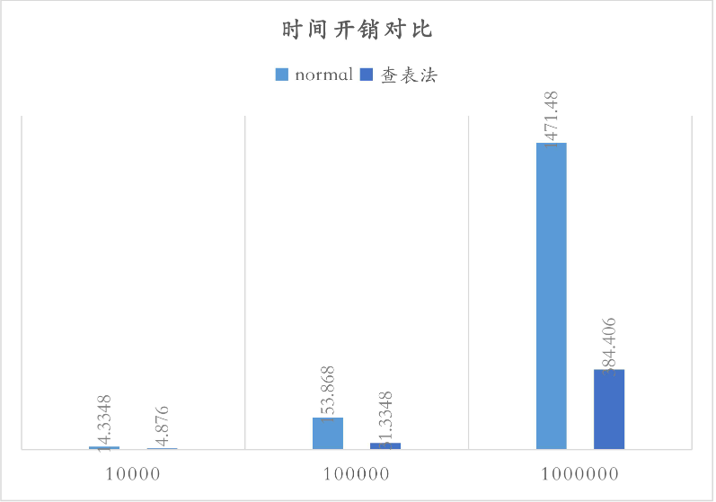

# SM4优化

        本次实验主要使用了查表法优化

        查表法：“用空间换时间”  

        在 sm4 算法的轮函数中，最主要的变换就是 T 函数中的 s 盒和循环移位。因此，一个很自然  的想法就是——我们可以使用查表的方法来代替实际的变换，通过预先定义的数组表就可以实时 索引出要求的结果。比较极端的是我们直接遍历 2^32 中可能的输入然后得到所有的可能的 T 函数输出。但是这样不仅牺牲了大量的内存，查表的时间也会变长。因此，我们选择分为 4 个 8bit->32bit 的表。  
        制表的过程首先将 T 函数的输入分为 x0，x1，x2，x3（8bit）。以 x0 举例，经过 s 盒我们可以得到 SBOX（x0），然后将其左移填充到 32 位，即 SBOX(X0)<<24。然后经过循环左移异或之后我们可以得到 L（SBOX(X0)<<24）遍历所有的 x0，我们就可以得到一个表 BOX0[X0]= L （SBOX(X0)<<24）  

        具体的实现函数为：  

```c

void zhibiao()

{
	u8 i;
	for (i = 0; i < 256; i++)
	{
		BOX0[i] = L1(find_sbox(i) << 24);
	}

}
```


        类似地，BOX1[X1]= L（SBOX(X1)<<16），BOX2[X2]= L（SBOX(X2)<<8），BOX3[X3]=（SBOX(X3)）也都可以给出。  

        假设 temp 就是 T 函数的 32bit 输入，然后我们的 T 函数的结果就可以直接表示为  
BOX0[(u8)temp >> 24] ^ BOX1[(u8)temp >> 16] ^ BOX2[(u8)temp >> 8] ^ BOX3[(u8)temp];  
        对应的轮函数就变为：

```c
void round_chabiao(u32 x[], u32 RK[]) {
	short i;
	u32 temp;
	for (i = 0; i < 32; i++) {
		temp = x[(i + 1) % 4] ^ x[(i + 2) % 4] ^ x[(i + 3) % 4] ^ RK[i];
		x[(i + 4) % 4] = x[i % 4] ^ BOX3[(u8)(temp >> 24)] ^ BOX2[(u8)(temp >> 16)] ^ BOX1[(u8)(temp >> 8)] ^ BOX0[(u8)temp];
	}
}

```

        综上我们可以得到

        我们给出一个非常直观的对比——查表法与普通实现的 SM4 的时间开销（ms）

        

        可以看出优化十分的明显


## 免责说明：

        该实验代码由本人在大二下学期计算机系统原理完成，当时组员有郭昊杉，冯信宇，陈尔然，如果此次与上述三人上交同一个代码，则我认为合理。