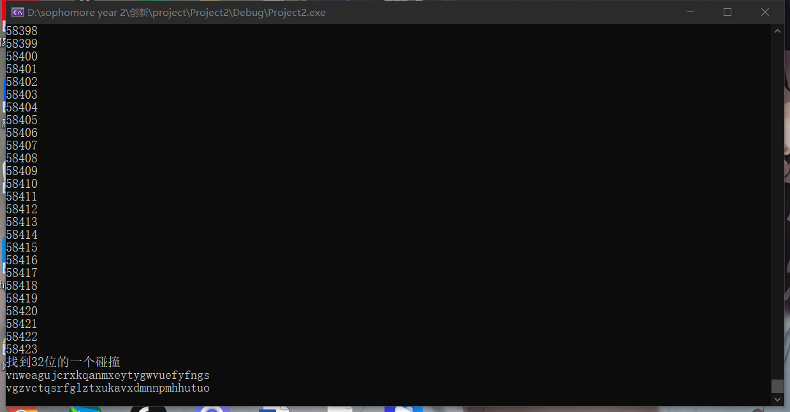

# SM3的生日攻击

## 实验原理：

  使用的SM3代码为从 [SM3算法的C++实现（代码）_清梦长安的博客-CSDN博客_sm3实现](https://blog.csdn.net/nicai_hualuo/article/details/121555000)中所得到的C++源码。

  利用了map来进行字典攻击，随机生成32长的字符串，计算其杂凑值并且将杂凑值的前16（或者32位）作为键，字符串作为值。每次生成了杂凑值检索一下有没有对应的键值对，如果有则碰撞成功。

## 代码说明：

    首先创建一个字典，然后进入一个循环。

    在循环中每次生成一个随机的32 长的字符串，然后计算这个字符串的hash值。根据hash的高32bit（代码中hash值以16进制字符串存储，所以是4*8=32bit）为键搜索是否有碰撞，如果没有则将这一对添加进字典。如果有则输出

    在下面的代码中这个过程重复两遍，第一遍找32bit碰撞，第二遍找64bit碰撞，但是时间不够失败了。

```c
int main() {//主函数
	map<string, string> list;
	srand((unsigned)time(NULL));
	string str;
	string paddingValue;
	string result;
	
	for (unsigned int i = 0; i < 0xffffffff; i++)
	{
		for (int j = 0; j < 32; j++)
		{
			str.insert(0, 1, str26[rand() % 26]);
		}
		paddingValue = padding(str);
		result = iteration(paddingValue);
		if (list[result.substr(0, 8)] !=""&& list[result.substr(0, 8)] !=str )//此处需要注意，result以16进制string构成，因此8个字符代表32位。
		{
			cout << "找到32位的一个碰撞" << endl;
			cout << str << endl;
			cout << list[result.substr(0, 8)] << endl;
			break;
		}
		else {
			list[result.substr(0, 8)] = str;
		}
		str.clear(); 
		cout << i << endl;
	}
	list.clear();
	for (unsigned int i = 0; i < 0xffffffff; i++)
	{
		for (int j = 0; j < 32; j++)
		{
			str.insert(0, 1, str26[rand() % 26]);
		}
		paddingValue = padding(str);
		result = iteration(paddingValue);

		if (list[result.substr(0, 16)] != "" && list[result.substr(0, 16)] != str)
		{
			cout << str << endl;
			cout << list[result.substr(0, 16)] << endl;
			break;
		}
		else {
			list[result.substr(0, 16)] = str;
		}
		str.clear();
	}
	


	
	
}
```


## 测试方法：

运行这个cpp文件即可。

## 测试结果：

找到SM3 高32位的一个碰撞，以下两个字符串产生杂凑值的高32位相同。

共计算了58423次，花费4个小时，比理论的2^16要少一些


vnweagujcrxkqanmxeytygwvuefyfngs
vgzvctqsrfglztxukavxdmnnpmhhutuo


