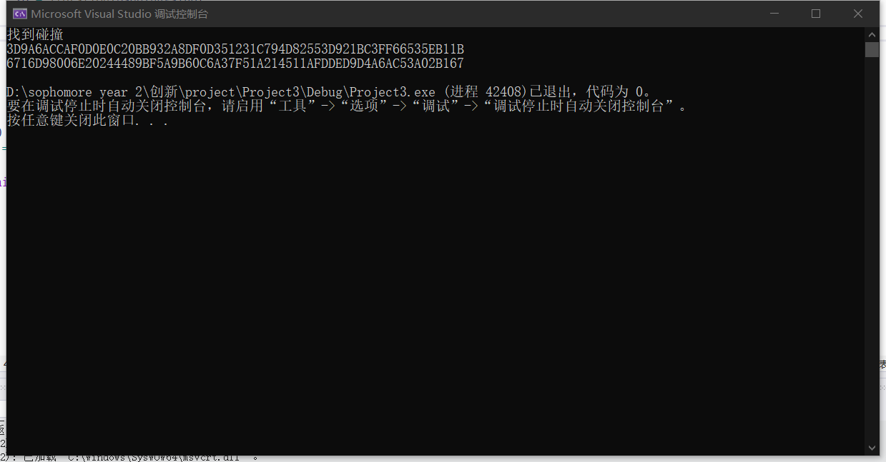

# SM3的Rho 攻击

## 实验原理：

  使用的SM3代码为从 [SM3算法的C++实现（代码）_清梦长安的博客-CSDN博客_sm3实现](https://blog.csdn.net/nicai_hualuo/article/details/121555000)中所得到的C++源码。

  主要的逻辑为希望能够构造一个环，代码逻辑如下所

$$
\begin{aligned}
&input:\{0,1\}^l\\
&output:x,x' with \ H(x)=H(x')\\
&x_0 =\{0,1\}^{l+1}\\
&x'=x=x_0\\
&while(1):\\
&\ \ x=H(x)\\
&\ \ x'=H(H(x'))\\
&\ \ x=H(x)\\
&\ \ if\ x=x'\ break\\
&x'=x \ x=x_0\\
&while(1)\\
&\ \ if(H(x)=H(x'))\ return \ x,x'\\
&\ \ else\ x=H(x),x'=H(x')
\end{aligned}
$$

其中为了减少攻击难度，hash值只取高位

## 代码说明：

        在此主要说明攻击所使用的的代码。

        首先随机生成一个32长的char数组。然后将x和x0都赋为这个值。然后计算hash（x）和hash（hash（x0))。比较这两个hash值的高位，如果相同则破除循环，否则继续循环（下图比较了高四位，由于hash值是16进制字符串，所以比较的是16bit）
        当从循环出来以后让x0=x，x=str。然后不断计算自身的hash值，直到有碰撞产生为止。输出两个碰撞的字符串。

```c
int main() {//主函数
	map<string, string> list;
	srand((unsigned)time(NULL));
	string str;
	string paddingValue;
	string result;
	string x, x0;
    // 生成随机的字符串
	for (int j = 0; j < 32; j++)
	{
		str.insert(0, 1, str26[rand() % 26]);
	}
	x = str;
	x0 = str;
	while (1)
	{
		paddingValue= padding(x);
		x= iteration(paddingValue);
		paddingValue = padding(x0);
		x0 = iteration(paddingValue);
		paddingValue = padding(x0);
		x0 = iteration(paddingValue);
		if (x.substr(0, 4) == x0.substr(0, 4))
		{
			break;
			cout << "jieshule" << endl;
		}
			
	}
	x0 = x;
	x = str;

	while(1)
	{
		if (iteration(padding(x)).substr(0, 4) == iteration(padding(x0)).substr(0, 4))
		{
			cout << "找到碰撞" << endl;
			cout << x << endl;
			cout << x0 << endl;
			break;
		}
		x = iteration(padding(x));
		x0 = iteration(padding(x0))
	}
}
```

## 测试方法

将Rho_method.cpp随便放入一个项目中跑就可以，此处只提供了cpp文件。

## 测试结果

得到16bit碰撞结果如下

3D9A6ACCAF0D0E0C20BB932A8DF0D351231C794D82553D921BC3FF66535EB11B
6716D98006E20244489BF5A9B60C6A37F51A214511AFDDED9D4A6AC53A02B167

以下为截图


