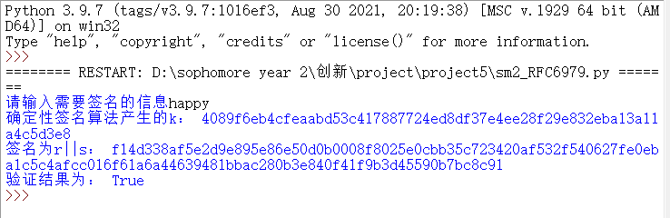

# 使用了RFC6979 确定性签名算法的SM2

## 实验原理：

  由于重点是生成k，所以sm2算法使用了gmssl库。

  在生成k的时候，完全按照以下RFC6979的标准实行：

```
   Generation of k
 Given the input message m, the following process is applied:
 a. Process m through the hash function H, yielding:
 h1 = H(m)
 (h1 is a sequence of hlen bits).
 b. Set:
 V = 0x01 0x01 0x01 ... 0x01
 such that the length of V, in bits, is equal to 8*ceil(hlen/8).
 For instance, on an octet-based system, if H is SHA-256, then V
 is set to a sequence of 32 octets of value 1. Note that in this
 step and all subsequent steps, we use the same H function as the
 one used in step 'a' to process the input message; this choice
 will be discussed in more detail in Section 3.6.
 c. Set:
 K = 0x00 0x00 0x00 ... 0x00
 such that the length of K, in bits, is equal to 8*ceil(hlen/8).
 d. Set:
 K = HMAC_K(V || 0x00 || int2octets(x) || bits2octets(h1))
 where '||' denotes concatenation. In other words, we compute
 HMAC with key K, over the concatenation of the following, in
 order: the current value of V, a sequence of eight bits of value
 0, the encoding of the (EC)DSA private key x, and the hashed
 message (possibly truncated and extended as specified by the
 bits2octets transform). The HMAC result is the new value of K.
 Note that the private key x is in the [1, q-1] range, hence a
 proper input for int2octets, yielding rlen bits of output, i.e.,
 an integral number of octets (rlen is a multiple of 8).
 e. Set:
 V = HMAC_K(V)
 f. Set:
 K = HMAC_K(V || 0x01 || int2octets(x) || bits2octets(h1))
 Note that the "internal octet" is 0x01 this time.
 g. Set:
 V = HMAC_K(V)
 h. Apply the following algorithm until a proper value is found for
 k:
 1. Set T to the empty sequence. The length of T (in bits) is
 denoted tlen; thus, at that point, tlen = 0.
 2. While tlen < qlen, do the following:
 V = HMAC_K(V)
 T = T || V
```

## 代码说明：

本次实验用了如下的库

```python
import base64
import binascii
import hmac
import hashlib 
from gmssl import sm2, func
```

### 函数定义：

这个就是实现了HMAC的函数

```python
def HMAC_K(k,m):
    """
    k是密钥，m是消息，都是byte形式
    """
    h1 = hmac.new(k, m, hashlib.sha256).digest()
    return h1
```

        这个就是最为精髓的产生确定性签名的关键，根据私钥与消息的hash值来产生确定的k。函数的设计完全按照RFC6979来进行设计

        首先初始定义了v和k，然后如下图所示不断得计算HMAC,最后为了让k符合要求，通过加盐的方式循环。

```python
def generate_k(msghash,x):
    """
    k是密钥，m是消息，都是byte形式
    """
    v = b'\x01' * 32
    k = b'\x00' * 32
    k=HMAC_K(k,v+b'\x00'+x+msghash)
    v = HMAC_K(k,v)
    k=HMAC_K(k,v+b'\x01'+x+msghash)
    v = HMAC_K(k,v)
    v = HMAC_K(k,v)
    while(int.from_bytes(v, byteorder='big')>=int.from_bytes(bytes.fromhex(n), byteorder='big')-1):
        k=HMAC_K(k,v+b'\x00')
        v=HMAC_K(k,v)
    return binascii.hexlify(v).decode("ascii")
```

        此为实现签名的函数，首先产生消息的sha256值，然后根据私钥和hash值生成k，并进行sm2签名。

```python
def sm2_sign(m,public_key,private_key):
    """
    此处的m为byte
    """
    msghash=hashlib.sha256(m).digest()
    pri=bytes.fromhex(private_key)#私钥的byte形式
    k=generate_k(msghash,pri)#确定性签名算法得到k
    sm2_crypt = sm2.CryptSM2(
    public_key=public_key, private_key=private_key)
    sign = sm2_crypt.sign(m, k) #  16进制
    return sign
```

验证只需要公钥即可

```python
def sm2_vertify(m,sign,public_key):
    sm2_crypt = sm2.CryptSM2(
    public_key=public_key,private_key='')#验证的时候不需要私钥，所以直接给一个空的
    return sm2_crypt.verify(sign,m )
```

### 测试代码：

先输入想要签名的信息，然后产生签名并验证。

```python
m=input("请输入需要签名的信息")

sign=sm2_sign(m.encode("utf-8"),public_key,private_key)#进行了签名
print("签名为r||s：",sign)
print("验证结果为：",sm2_vertify(m.encode("utf-8"),sign,public_key))#进行了验证
```

### 测试方法:

直接输入想要签名的字符串，然后就会展示是否验证成功

## 运行结果：

