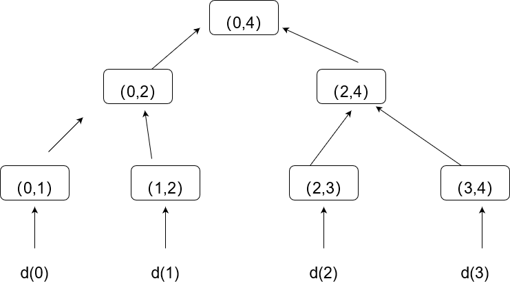
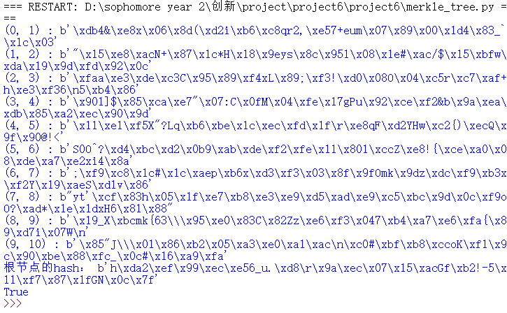

# merkle tree

## 实验原理：

      本python脚本根据RFC6962编写了MerkleTree 类，并设计了包括添加叶子节点，计算对应节点的hash值等方法。

      首先我们拥有一组输入，分别为d（0），d（1）.....  以他们的加盐后的hash（0x00||d）作为对应的叶子节点的hash值。然后再往上计算其他节点的hash（0x01||hi||hj）。其中hi和hj应当是指向同一个父节点的节点的hash值。

      我们利用字典来存储merkle树，其中键为（k1,k2）,每一个节点对应的键的设计如下图范例所示。



## 代码说明：

    max_power2(n):用来获得比n小的最大的2次幂，利用二叉树的性质根据上图的设计来计算父节点等节点对应的键。

```python
def max_power2(n):
    """
    用来获得比n小的最大的2次幂
    """
    k = 1
    while k < n :
        k = k<<1
    return k >>1
```

    定义MerkleTree类和初始化函数。初始化的时候先将size调整为0，并创建一个字典来记录merkletree

```python
class MerkleTree():
    def __init__(self):
        """
        初始化，并建立一个字典来存储merkletree
        """
        self.size = 0
        self.hashtree = {} 
```

    addLeaf(self, string): 添加叶子节点。string为对应叶子节点的信息字符串。计算出字符串的hash值（此处注意加了\x00 的盐），然后再

```python
def addLeaf(self, string):
        """
        添加叶子节点，注意hash的时候前面+0x00
        """
        h = sha256(b'\x00'+str(string).encode('utf-8')).digest()
        self.size += 1
        self.hashtree[(self.size-1,self.size)]=h
```

    mth(self, k1, k2): 计算出（k1，k2）节点的hash值，如果计算了根节点（0，size）的hash值能够递归的计算出整个merkletree。

    逻辑为首先查看这个点是否已经计算过或者是叶子节点，如果已经计算过则直接返回，否则根据两个子节点计算出自己的hash值（此处加盐0x01），这里是递归的进行的。

```python
def mth(self, k1, k2):
        """ 
        能够递归的创建merkletree
        注意此处加盐为0x01
        """
        try:
            node_h = self.hashtree[(k1,k2)]
        except KeyError as v:   
            k = k1 + max_power2(k2-k1)
            node_h = sha256(b'\x01' + self.mth(k1, k) + self.mth(k,k2)).digest()
            self.hashtree[(k1,k2)]=node_h
        return node_h
```

    auditPath(self, m, n=None): 得到叶子结点d（m）到根节点最短路径对应的那些节点的hash值列表。

    逻辑为如果（k1,k2）是叶子节点返回一个空列表，否则递归的返回子节点的值hash值加上下面的路径列表。

```python
    def auditPath(self, m, n=None):
        """
        返回存储d(m)到根节点的最短路径的列表
        """

        if not n: n = self.size
        def _auditPath(m, k1, k2):
            if (k2-k1) == 1:
                return [ ] 
            k = k1 + max_power2(k2-k1)
            if m < k:
                path = _auditPath(m, k1, k) + [self.mth(k,k2),]
            else:
                path = _auditPath(m, k, k2) + [self.mth(k1,k),]
            return path
        
        return _auditPath(m, 0, n)
```


    仿照RFC6962中的存在性证明思路，根据上一个函数获得的audit_path 可以证明d（m）对应的叶子确实存在。

    逻辑就是根据路径计算一遍根节点，跟真实的根节点对比来确定是否真实存在。

```python
    def Proof(self, m, n, leaf_hash, root_hash, audit_path):
        """ 
        根据上一个函数的得到的audit_path来证明的d(m)对应的叶子节点确实存在
        此处仍然需要注意加盐
        """
        
        def _SubProof(m, k1, k2, i):
            
            if len(audit_path) == i:
                return leaf_hash
            k = k1 + max_power2(k2-k1)
            ithAuditNode = audit_path[len(audit_path) - 1 - i]
            if m < k:
                hv = sha256(b'\x01' + _SubProof(m, k1, k, i+1) + ithAuditNode ).digest()
            else:
                hv = sha256(b'\x01' + ithAuditNode + _SubProof(m, k, k2, i+1) ).digest()
            return hv
           
        hv = _SubProof(m, 0, n, 0)        
        return hv == root_hash
```

接着利用mth得到计算根节点和叶子节点的函数

```python
def rootHash(self, n=None):
        """ 
        merkle树根节点的哈希值
        """
        if not n: n = self.size
        if n > 0:
            return self.mth(0, n)
        else:
            return sha256(''.encode('utf-8')).digest()  
            
    def leafHash(self, m):
        """ 
        用来查看d(m)对应的hash值
        """
        return self.mth(m, m+1)
```

### 测试代码：

    这里我们先创建一个merkletree，然后添加10个叶子结点，然后输出整颗树，来测试我们是否设计正确。

    然后再建立一个tree2，添加10w个叶子结点

    然后计算根节点的hash值并输出，在这个过程中整个树构建完毕。

    最后得到d（3）到根节点的路径，然后证明是否存在，并输出

```python
tree1=MerkleTree()
n=10
for i in range(0,n):#创造一个叶子结点数为10w的merkle数
    tree1.addLeaf(str(i))
for i in tree1.hashtree.keys():
    print(i,":",tree1.hashtree[i])


tree2=MerkleTree()
n=100000
#d(0),d(1),....d(n-1)
for i in range(0,n):#创造一个叶子结点数为10w的merkle数
    tree2.addLeaf(str(i))

print("根节点的hash值",tree2.mth(0,n))#为了递归的计算出根节点的hash值

path1=tree2.auditPath(3)#获得d（3）到根节点的最短路径
#print(path1)

print(tree2.Proof(3,n,tree2.leafHash(3),tree2.rootHash(),path1))#根据上述路径判定d（3）是否在merkle树当中径判定d（3）是否在merkle树当中
```


## 测试方法：

直接运行脚本即可。

## 运行截图



## 参考资料：

1. [Merkle Tree 实现细节及（不）存在性证明_跨链技术践行者的博客-CSDN博客](https://blog.csdn.net/shangsongwww/article/details/85339243)

2. [Merkle树算法解析及python实现_谨墨的博客-CSDN博客_merkle树 python](https://blog.csdn.net/weixin_43137080/article/details/115653424)

3. [GitHub - nymble/merkletree at 893c9e955f69d99692ef64b99098f6db8b4fd207](https://github.com/nymble/merkletree/tree/893c9e955f69d99692ef64b99098f6db8b4fd207)