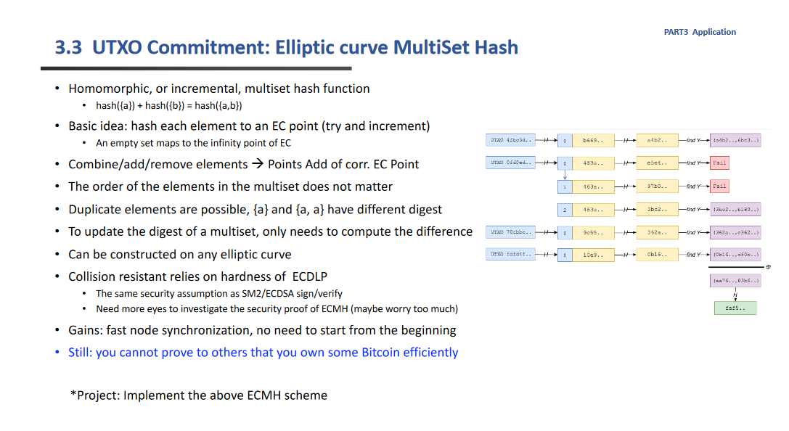
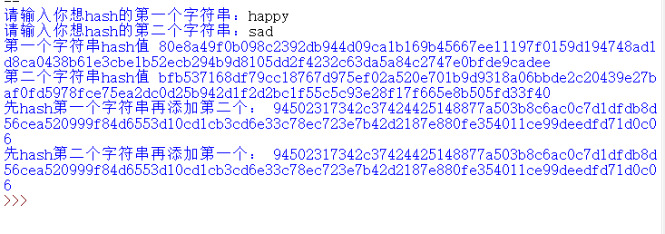

# 在SM2算法的基础上实现ECMH:

## 实验原理：



    为了实现将任意消息hash到SM2的椭圆曲线上，首先利用sha256得到消息哈希值h（为了保证h小于n，如果大了就加盐重新hash），然后计算hG 的 x,y坐标，就可以将这个 x||y作为这个元素的hash值。这个hash成立于椭圆曲线已知  P=hG的P 和G的时候求解h困难。

    为了实现对于一个无序集合的hash值能保持统一，在原有的hash值再添加新的元素来生成新的hash值的时候，利用椭圆曲线的点加，这样就可以不在意顺序，目前只设计了一次加一个元素的设计。


## 代码说明：

本实验利用了gmssl库中sm2的各种方法

```python
from gmssl import sm2
from hashlib import sha256
import binascii
```

### 函数定义：

    ECMH(m): 此处直接将消息字符串msha256得到bytes数组，检查这个杂凑值的整数形式是否超过sm2曲线的阶n，如果大了就反复加盐hash直到符合要求。

    然后以这个hash值的整数作为系数计算P1 = h* G。其中G为sm2曲线定义的元点。
 P1=sm2_c._kg(pri,ecctable['g'])就是做sm2椭圆曲线上的点乘。

     P1就是这个椭圆曲线上的点坐标x||y

```python
def ECMH(m):
    """
    返回了m的hash对应的椭圆曲线上的点的x坐标和y坐标16进制的字符串拼接,即x||y
    考虑到知道了y计算x相对简单，因此直接以x作为最终的hash值
    m为字符串
    """
    hash_256=sha256(str(m).encode()).digest()
    while(int(hash_256.hex(),16)>=int(ecctable['n'],16)):#为了让这个值处于（0，n-1）之间，如果大了就加盐
        hash_256=sha256(b'\x00'+hash_256)
    pri=int(hash_256.hex(),16)
    sm2_c=sm2.CryptSM2(private_key="",public_key="")#因为只是利用其中函数所以不设置公钥私钥
    P1=sm2_c._kg(pri,ecctable['g'])#此处计算了哈希值*G后点的坐标x||y
    return P1
```

ECMH_append(h,m): 计算已有的hash值添加新元素后的hash值。

其实就是先计算出m的哈希值对应的椭圆曲线的点，然后将两个点相加，由于sm2椭圆曲线具有同态的性质，所以不管先hash那一个得到的结果都相同。

__add_point()函数是两个点相加，得到的是有坐标z的，_convert_jacb_to_nor就是将这个坐标转化为正常的x||y。

```python
def ECMH_append(h,m):
    """
    为ECMH后的hash值添加新的元素后形成hash
    其中m为字符串
    """
    hash_256=sha256(str(m).encode()).digest()
    while(int(hash_256.hex(),16)>=int(ecctable['n'],16)):#为了让这个值处于（0，n-1）之间，如果大了就加盐
        hash_256=sha256(b'\x00'+hash_256)
    sm2_c=sm2.CryptSM2(private_key="",public_key="")
    pri=int(hash_256.hex(),16)
    P1=sm2_c._kg(pri,ecctable['g'])#得到后来添加的字符串的哈希值对应的坐标
    P=sm2_c._add_point(P1,h)#两个点相加
    P=sm2_c._convert_jacb_to_nor(P)#得到最终的x||y
    return P
```

### 测试代码：

先输入两个字符串，然后分别输出两个字符串的hash值。

然后分别添加上对方，再输出hash值来进行对比

```python
p1=input("请输入你想hash的第一个字符串：")
p2=input("请输入你想hash的第二个字符串：")
h1=ECMH(p1)
h2=ECMH(p2)
print("第一个字符串hash值",h1)
print("第二个字符串hash值",h2)
print("先hash第一个字符串再添加第二个：",ECMH_append(h1,p2))
print("先hash第二个字符串再添加第一个：",ECMH_append(h2,p1))
```


## 测试方法：

    按照提示输入两个字符串，然后得到两个字符串对应的hash值和不同顺序生成的集合的hash值。

## 运行截图：

