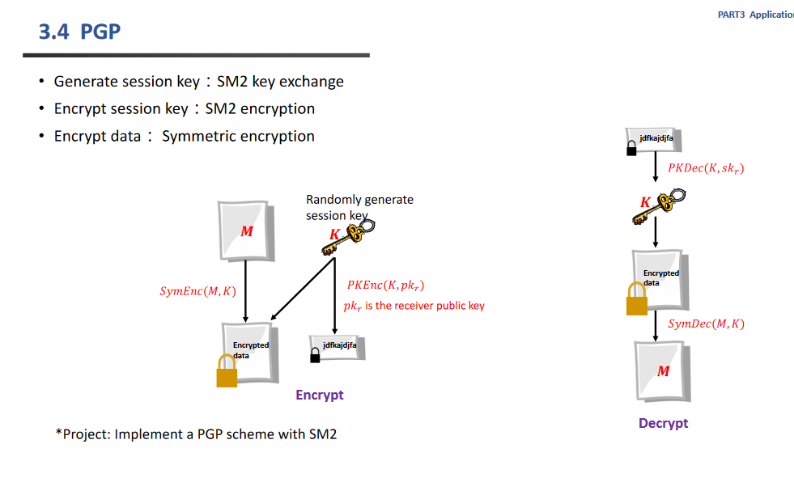
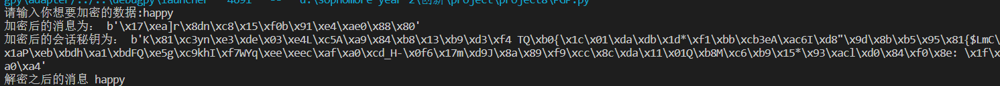

# Implement a PGP scheme with SM

## 设计原理：



    发送者首先随机生成一个SM4对称加密的密钥，然后利用这个密钥对称加密消息。然后使用接受者的公钥利用sm2加密将这个消息加密。将加密后的消息和密钥发送给接送者。

    接受者接受来自于发送者的两个消息，然后根据加密密钥和自己的私钥计算出对会话密钥，然后对称解密出消息。

    测试方法：按照对话框输入消息就可以看到加密后的密钥以及消息和解密后的消息。可以对比解密后的消息来判断是否成功。

## 代码说明：

本次实验引用了gmssl库中关于sm2，sm4相关算法，并提前设定好了一些参数

其中str36是为了产生随机的密钥

```python
from gmssl import sm2 ,sm4
str36="1234567890qwertyuiopasdfghjklzxcvbnm"
iv = b'\x00\x00\x00\x00\x00\x00\x00\x00\x00\x00\x00\x00\x00\x00\x00\x00'

#以下均是接受者的密钥
private_key= '00B9AB0B828FF68872F21A837FC303668428DEA11DCD1B24429D0C99E24EED83D5'
public_key = 'B9C9A6E04E9C91F7BA880429273747D7EF5DDEB0BB2FF6317EB00BEF331A83081A6994B8993F3F5D6EADDDB81872266C87C018FB4162F5AF347B483E24620207'
```

### 函数定义：

generate_random_k(): 随机生成SM4的密钥，此处由于引用的gmssl库的密钥要求是随机16长字符串，所以如下设计

```python
def generate_random_k():
    """
    生成随机的k
    """
    str=""
    for i in range(0,16):
        str+=str36[random.randint(0,35)]
    return str.encode('utf-8')
```

sender(m): 模仿第一个人，先产生一个随机的k ，然后设置好sm4加密密钥并加密消息。

再将K以接受者的公钥用sm2加密好（注意此处没有用到私钥，因为应当不知道)，返回sm4加密的m和sm2加密的k

```python
def sender(m):
    K=generate_random_k()#生成一个随机的k

    crypt_sm4 = sm4.CryptSM4()#布置sm4堆成加密器
    crypt_sm4.set_key(K, sm4.SM4_ENCRYPT)
    encrypt_m = crypt_sm4.crypt_ecb(m.encode("utf-8")) #得到消息加密
    
    sm2_crypt = sm2.CryptSM2(public_key=public_key, private_key="")#布置sm2加密
    enc_k = sm2_crypt.encrypt(K)#得到密钥加密
    return (encrypt_m,enc_k)
```


receiver(encrypt_m,enc_k): 模仿接受者，先将密钥解密出来，然后用这个密钥解密消息，十分简单的获得解密的密文

```python
def receiver(encrypt_m,enc_k):
    """
    得到发送者发来的加密的消息和密钥之后
    先解密得到密钥，然后再解密消息
    """
    sm2_crypt = sm2.CryptSM2(public_key=public_key, private_key=private_key)#布置sm2加密
    K=sm2_crypt.decrypt(enc_k)
    crypt_sm4 = sm4.CryptSM4()#布置sm4堆成加密器
    crypt_sm4.set_key(K, sm4.SM4_DECRYPT)
    decrypt_m = crypt_sm4.crypt_ecb(encrypt_m)
    return decrypt_m.decode("utf-8")#返回解密的消息
```

## 测试代码：

    先输入想要加密的数据，然后模拟发送者获得加密的消息和加密的密钥，然后再传给接受者，获得解密后的明文

```python
m=input("请输入你想要加密的数据:")

encrypt_m,enc_k=sender(m)
print("加密后的消息为：",encrypt_m)
print("加密后的会话秘钥为：",enc_k)

dec_m=receiver(encrypt_m,enc_k)

print("解密之后的消息",dec_m)
```

## 测试方法

直接输入想要加密的明文就可以

## 运行截图

