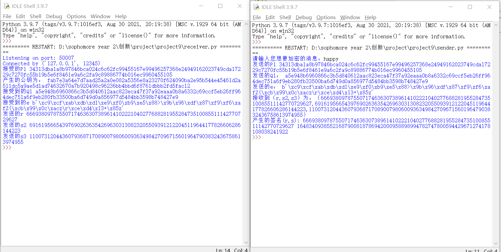

# implement sm2 2P sign with real network communication:

      完全根据ppt来进行设计双方签名,并且设计了两个脚本sender和receiver来模拟左右的两个人。利用了socket的TCP连接来模拟真实的网络交流。


## 代码说明：

### 函数定义：

 generate_d1() 用来生成符合sm2曲线要求的私钥。对于receiver来说有类似的generate_d2()。

```python
def generate_d1():
    """
    产生初始的d1
    """
    n=int(ecctable['n'],16)
    d1=random.randint(1,n-1)
    return d1
```

    generate_G_1(G) G为椭圆曲线上一点x||y，这个函数是为了获得G的逆元-G

```python
def generate_G_1(G):
    """
    产生-G
    """
    sm2_c=sm2.CryptSM2(private_key="",public_key="")
    leng=len(G)
    xg=G[0:sm2_c.para_len]
    yg=G[sm2_c.para_len:leng]
    yg=int(yg,16)
    yg=(-yg)%int(ecctable['p'],16)
    yg=hex(yg)[2:]
    G_1=xg+yg
    return G_1
```

generate_P1(d1): 用来产生 d1^{-1} *G ，为了后续生成公钥P所用。

```python
def generate_P1(d1):
    """
    用来产生P1
    """
    n=int(ecctable['n'],16)
    sm2_c=sm2.CryptSM2(private_key="",public_key="")
    P1=sm2_c._kg(inverse(d1,n),ecctable['g'])
    return P1
```

generate_Q1_e(m,z):用来生成发送给receiver 的Q1,e

```python
def generate_Q1_e(m,z):
    """
    产生需要的Q1,e
    z和m都是字符串
    """
    e=sha256(z.encode('utf-8')+m.encode('utf-8')).digest()
    k1=generate_d1()
    n=int(ecctable['n'],16)
    sm2_c=sm2.CryptSM2(private_key="",public_key="")
    Q1=sm2_c._kg(k1,ecctable['g'])
    return(Q1,e,k1)
```

generate_sign(k1,d1,r,s2,s3):用来生成最后的签名（r,s）

```python
def generate_sign(k1,d1,r,s2,s3):
    n=int(ecctable['n'],16)
    s=((d1*k1)*s2+d1*s3-r)%n
    if s!=0 and s!=n-r : 
        return(r,s)
```

    generate_r_s2_s3(d2,Q1,e):  receiver用来生成发送给sender的r，s2，s3。原理和ppt中所示一致

```python
def generate_r_s2_s3(d2,Q1,e):
    n=int(ecctable['n'],16)
    sm2_c=sm2.CryptSM2(private_key="",public_key="")
    k2=generate_d2()
    Q2=sm2_c._kg(k2,ecctable['g'])
    k3=generate_d2()
    temp=sm2_c._kg(k3,Q1)
    P=sm2_c._add_point(temp,Q2)#两个点相加
    P=sm2_c._convert_jacb_to_nor(P)#得到最终的x||y
    x1=int(P[0:sm2_c.para_len],16)
    r=(x1+int(e.hex(),16))%n
    s2=(d2*k3)%n
    s3=d2*(r+k2)%n
    return(r,s2,s3)
```

### 测试代码：

以下按照交换信息的流程来进行说明，并不是两个实际文档中的顺序

首先是receiver，准备监听TCP连接

```python
HOST = ''
PORT = 50007
s = socket.socket(socket.AF_INET, socket.SOCK_STREAM)
s.bind((HOST, PORT))
s.listen(5)
print('Listening on port:',PORT)
conn, addr = s.accept()
print('Connected by', addr)
```

接着是sender 连接receiver。

```python
HOST = '127.0.0.1'
PORT = 50007
s = socket.socket(socket.AF_INET, socket.SOCK_STREAM)
try:
    s.connect((HOST, PORT))
except Exception as e:
    print('Server not found or not open')
    sys.exit()
```

sender计算P1 ，发送给receiver

```python
d1=generate_d1()
P1=generate_P1(d1)
s.sendall(P1.encode('utf-8'))#发送P1
```

receiver 接受P1,并且计算出公钥P，并且通知sender继续下一步

```python
P1 = conn.recv(1024).decode('utf-8')#接受P1

d2=generate_d2()
P=generate_P(d2,P1)#产生公钥
print("产生的公钥为：",P)
conn.sendall("OK".encode("utf-8"))
```

  sender接收到receiver的通知后开始计算出Q1和e并发送给receiver，并检查返回的信息来判断是否发送正确。

```python
assert an.decode('utf-8')=="OK","fail1"

Q1,e,k1=generate_Q1_e(m,Z)#产生并发送Q1,e,k1
s.sendall(Q1.encode('utf-8'))
an = s.recv(1024)
assert an.decode('utf-8')=="OK","fail2"

s.sendall(e)
an = s.recv(1024)
assert an.decode('utf-8')=="OK","fail3"
```

receiver 接受Q1,e，计算出r,s2,s3 发送给sender并且检查是否正确

```python
Q1=conn.recv(1024).decode('utf-8')#接受Q1
conn.sendall("OK".encode("utf-8"))

e=conn.recv(1024)#接受e
conn.sendall("OK".encode("utf-8"))


r,s2,s3=generate_r_s2_s3(d2,Q1,e)#产生r,s2,s3并发送给另一个人

conn.sendall(hex(r)[2:].encode('utf-8'))
an=conn.recv(1024)
assert an.decode('utf-8')=="OK","fail1"

conn.sendall(hex(s2)[2:].encode('utf-8'))
an=conn.recv(1024)
assert an.decode('utf-8')=="OK","fail1"

conn.sendall(hex(s3)[2:].encode('utf-8'))
an=conn.recv(1024)
assert an.decode('utf-8')=="OK","fail1"
```

sender接受以上信息计算签名，并输出签名的信息

```python
r=int(s.recv(1024).decode("utf-8"),16)#一下是接受r,s2,s3
s.sendall("OK".encode('utf-8'))
s2=int(s.recv(1024).decode("utf-8"),16)
s.sendall("OK".encode('utf-8'))
s3=int(s.recv(1024).decode("utf-8"),16)
s.sendall("OK".encode('utf-8'))

r,s=generate_sign(k1,d1,r,s2,s3)#产生签名
print("产生的签名(r,s):",r,s)
```

## 测试方法：

先运行receiver.py，再运行sender.py，然后在sender里面输入你想要签名的信息，则可以看到产生的公钥和签名结果

运行结果截图：

 