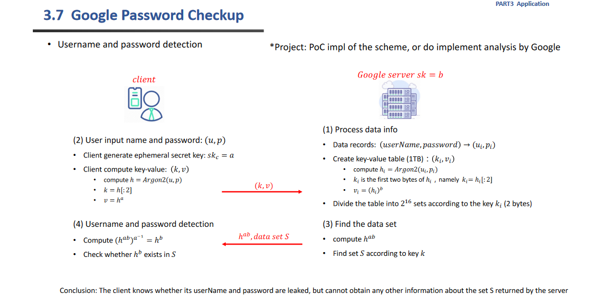
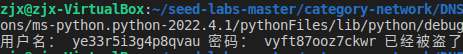

# PoC impl of the scheme, or do implement analysis by Google

      本项目实现了Google 的密码检查，具体的流程如老师的ppt所展示的一样




    

## 代码说明：
本次实验引用了gmssl库中关于sm2相关算法，引用了argon2

```python
from gmssl import sm2 
import argon2
```

### 函数说明：

    首先我们实现了一些需要用到的函数

    generate_p_u() 用来产生随机的用户名和对应的密码

```python
def generate_p_u():
    """
    password and username 
    """
    u=''
    for i in range(0,random.randint(10,20)):
        u+=str36[random.randint(0,35)]
    p=''
    for i in range(0,random.randint(10,20)):
        p+=str36[random.randint(0,35)]
    return (p,u)
```

generate_a() 用来产生合法的sm2曲线的私钥，其中ecctable[‘n’]为sm2曲线 的阶。

```python
 def generate_a():
    """
    产生a
    """
    n=int(ecctable['n'],16)
    d1=random.randint(1,n-1)
    return d1
```

ECMH(h)是将一个byte的值hash到sm2的椭圆曲线上的函数，主要原理就是将h 再sha256一遍，然后以这个杂凑值和G点乘获得一个新的点，这个点的坐标x||y作为返回值

```python
def ECMH(h):
    """
    将h hash到曲线上
    """
    hash_256=sha256(h).digest()
    while(int(hash_256.hex(),16)>=int(ecctable['n'],16)):#为了让这个值处于（0，n-1）之间，如果大了就加盐
        hash_256=sha256(b'\x00'+hash_256)
    pri=int(hash_256.hex(),16)
    sm2_c=sm2.CryptSM2(private_key="",public_key="")#因为只是利用其中函数所以不设置公钥私钥
    P1=sm2_c._kg(pri,ecctable['g'])#此处计算了哈希值*G后点的坐标x||y
    return P1
```

generate_G_1(G)     计算输入的椭圆曲线上的点G（x||y）的逆元，即-G

```python
def generate_G_1(G):
    """
    产生-G
    """
    sm2_c=sm2.CryptSM2(private_key="",public_key="")
    leng=len(G)
    xg=G[0:sm2_c.para_len]
    yg=G[sm2_c.para_len:leng]
    yg=int(yg,16)
    yg=(-yg)%int(ecctable['p'],16)
    yg=hex(yg)[2:]
    G_1=xg+yg
    return G_1
```

### 以上为使用的函数，接下来看测试过程：


    首先是仿照ppt，用户自己先生成一个用户名和密码，接着生成一个私钥a，然后利用argon2 库中的函数综合两者获得一个bytes对象h，让k为h的前两个字节。将h hash到sm2的椭圆曲线上，然后计算这个点+a*G后的点作为v

```python
#以下是用户自己的生成

SM=sm2.CryptSM2('','')

a=generate_a()

p,u=generate_p_u()#自己的用户名密码

h=argon2.argon2_hash(p,u)
k=h[:2]

h=ECMH(h)

temp=SM._kg(a,ecctable['g'])
v=SM._add_point(temp,h)#两个点相加
v=SM._convert_jacb_to_nor(v)#得到最终的x||y
```

    接下来是Google 的密码库的构成。首先生成自己的私钥b，然后生成100（此处为了快速所以设计的比较小，可以任意大）个用户名和密钥，仿照用户也来生成自己的k，v。并且以k为键建立字典，每一个键对应一个列表。

    为了体现我们检查的效果，将用户生成的用户名和密码加工后也加入库中

```python
#以下是库的生成
b=generate_a()

data_base=dict()
#随机生成100个来构建库
for i in range(0,100):
    p1,u1=generate_p_u()
    h1=argon2.argon2_hash(p1,u1)
    k1=h[:2]
    h1=ECMH(h1)
    temp=SM._kg(b,ecctable['g'])
    v1=SM._add_point(temp,h1)#两个点相加
    v1=SM._convert_jacb_to_nor(v1)#得到最终的x||y
    if k1 not in data_base.keys():
        data_base[k1]=[v1,]
    else:
        data_base[k1].append(v1)
    
#将用户的也加进来
temp=SM._kg(b,ecctable['g'])
v_s=SM._add_point(temp,h)#两个点相加
v_s=SM._convert_jacb_to_nor(v_s)#得到最终的x||y
if k not in data_base.keys():
    data_base[k]=[v_s,]
else:
    data_base[k].append(v_s)
```

        为了方便直接使用变量传递来模拟网络传递。数据库接受来自于用户的k，v。根据v计算出h^ab（也就是直接加上b*G），返回h^ab以及k对应的列表

```python
#根据库查找k,v ,并返回hab和set的东西

temp=SM._kg(b,ecctable['g'])
h_ab=SM._add_point(temp,v)
h_ab=SM._convert_jacb_to_nor(h_ab)
set=data_base[k]
```

    用户接收到h^ab和列表，使用椭圆曲线上减法获得h^b ,然后看此是否在返回的列表当中，如果在，那么说明自己的用户名和密码已经在Google 的库当中了。

```python
#用户根据返回的以上信息来看自己的密码是否在其中

temp=SM._kg(a,ecctable['g'])
temp=generate_G_1(temp)
h_b=SM._add_point(temp,h_ab)#两个点相加
h_b=SM._convert_jacb_to_nor(h_b)#得到最终的x||y
if h_b in set:
    print("用户名：",u,"密码：",p,"已经被盗了")
```


## 运行指导：

直接运行Google Password Checkup.py即可，需要安装argon2 和gmssl ，hashlib库。

安装方法利用pip即可（argon2可能在windows上难安装，可用ubuntu等）

运行截图：


